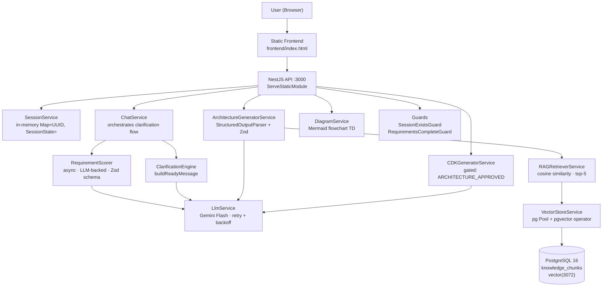
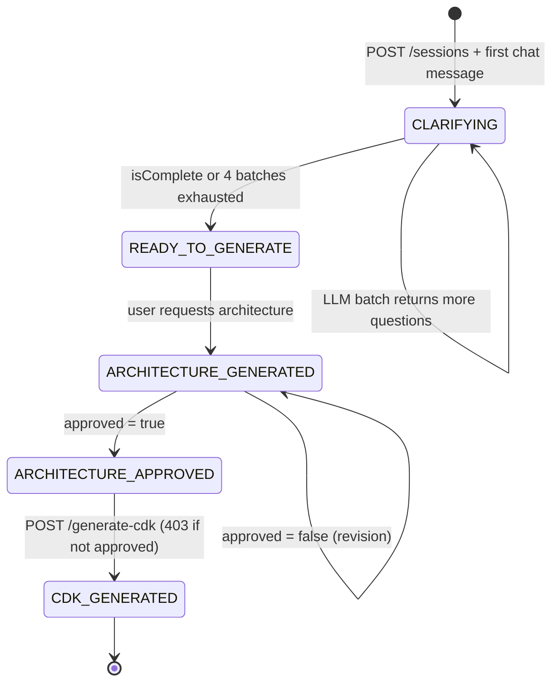
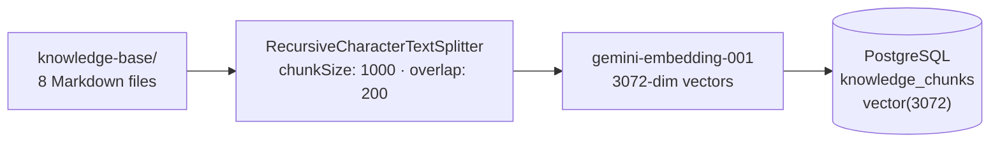
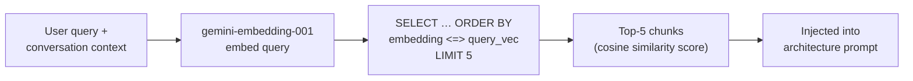
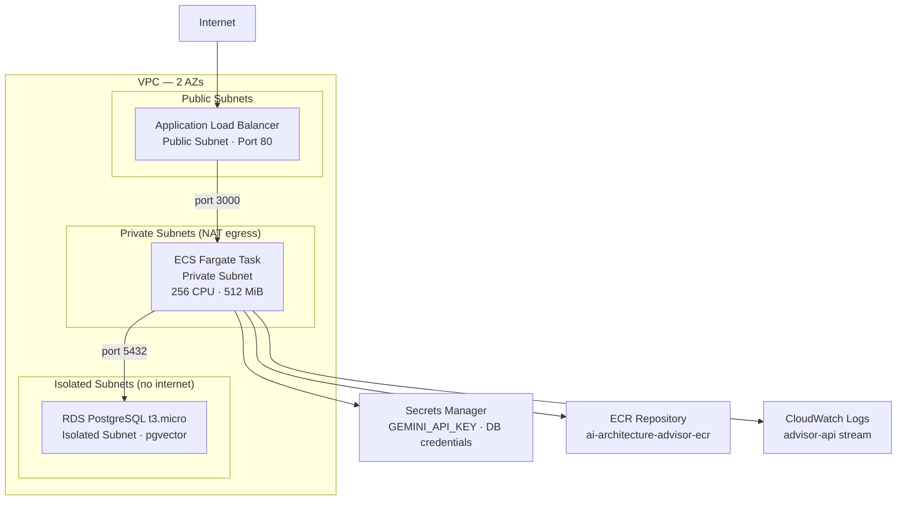

# Architecture — AI Cloud Architecture Advisor

This document covers the internal design of the system: service wiring, data flows, state machine, RAG pipeline, database schema, AWS deployment layout, and the reasoning behind key engineering decisions.

---

## 1. System Architecture



---

## 2. Conversation State Machine

Session `status` follows a strict one-way flow enforced by NestJS Guards at the route level.



### Batch clarification logic (ChatService)

Rather than calling the LLM on every user message, the system batches question generation:

```
User message arrives
      │
      ▼
session.pendingQuestions.length > 0?
      │ YES → shift() first question · no LLM call · clarificationRound++
      │
      NO
      ▼
session.clarificationBatch >= 4?
      │ YES → "After 4 rounds, still not enough specifics" → CLARIFYING (dead-end notice)
      │
      NO
      ▼
LLM call → generateStructured(messages, assessmentSchema)
  returns: { SCALE, LATENCY, PERSISTENCE, TEAM, BUDGET, COMPLIANCE, questions[], isComplete }
      │
      ├── isComplete = true OR questions.length = 0
      │       → buildReadyMessage() → READY_TO_GENERATE
      │
      └── else
              → pendingQuestions = questions.slice(1)
              → ask questions[0] · clarificationRound++ · CLARIFYING
              → clarificationBatch++
```

**Why this matters:** LLM calls are expensive. This design makes at most 4 LLM calls during clarification regardless of how many user turns occur. A session with 12 user messages might trigger only 2 LLM scoring calls.

---

## 3. RAG Pipeline

### Ingestion (`npm run ingest` locally · `POST /admin/ingest` in production)



- Each chunk is embedded individually (not in batch) to avoid silent failures
- 800 ms delay between chunks to respect Gemini free-tier rate limits
- No vector index — sequential scan (`ORDER BY embedding <=> $1 LIMIT 5`) is used; IVFFlat was removed because it has a 2000-dimension hard limit and `gemini-embedding-001` produces 3072-dim vectors; sequential scan is fast enough for a ~100-vector corpus
- Schema (`CREATE EXTENSION`, `CREATE TABLE IF NOT EXISTS`) is applied automatically in `VectorStoreService.onModuleInit()` on every container start — no manual migration step

### Database schema

```sql
CREATE TABLE knowledge_chunks (
  id          UUID PRIMARY KEY DEFAULT gen_random_uuid(),
  content     TEXT NOT NULL,
  source_file VARCHAR(255) NOT NULL,
  chunk_index INTEGER NOT NULL,
  metadata    JSONB,
  embedding   vector(3072),
  created_at  TIMESTAMP DEFAULT NOW()
);
```

### Retrieval (per architecture-generation request)



- Similarity score: `1 - (embedding <=> $1::vector)` (cosine distance → cosine similarity)
- Top-5 chunks are formatted and injected as `## Retrieved AWS Architecture Context` into the LLM prompt before the conversation history

### Knowledge base files

| File | Content |
|------|---------|
| `aws-well-architected.md` | 6-pillar framework summary with key evaluation questions |
| `aws-compute-patterns.md` | Lambda vs ECS vs EC2 vs App Runner decision tree |
| `aws-storage-patterns.md` | S3 vs EFS vs EBS vs DynamoDB vs RDS selection guide |
| `aws-networking-patterns.md` | VPC design, ALB vs API Gateway, CloudFront |
| `aws-event-driven-patterns.md` | SQS vs SNS vs EventBridge vs Kinesis |
| `aws-security-patterns.md` | IAM, Cognito, WAF, KMS patterns |
| `aws-cdk-examples.md` | Annotated CDK TypeScript patterns (implicit few-shot examples) |
| `aws-pricing-guidance.md` | Tier comparisons and cost optimisation principles |

---

## 4. Module Map

| Module | Key Files | Responsibility |
|--------|-----------|----------------|
| `session/` | `session.service.ts` | In-memory session store (`Map<string, SessionState>`); UUID keyed; no persistence |
| `chat/` | `chat.service.ts`, `dto/` | Entry point for user messages; drives the batch clarification queue; delegates to `RequirementScorer` and `ClarificationEngine` |
| `clarification/` | `requirement.scorer.ts`, `clarification.engine.ts` | `RequirementScorer` — async LLM call returning 6 dimension scores + follow-up questions; `ClarificationEngine` — `buildReadyMessage()` only (question selection moved to LLM) |
| `architecture/` | `architecture.service.ts`, `architecture-generator.service.ts`, `diagram.service.ts` | LLM call + Zod-parsed `ArchitectureRecommendation`; Mermaid diagram generation; `GET/POST /architecture` endpoints |
| `cdk/` | `cdk-generator.service.ts`, `cdk.controller.ts` | CDK TypeScript generation; supports `mode` (complete / skeleton) and `environment` (dev / staging / prod); gated by `RequirementsCompleteGuard` |
| `rag/` | `vector-store.service.ts`, `rag-retriever.service.ts`, `knowledge-ingester.service.ts`, `rag.controller.ts` | pgvector CRUD + similarity search; query embedding + retrieval; ingestion pipeline (triggerable via `POST /admin/ingest`); schema applied on startup |
| `llm/` | `llm.service.ts`, `prompt-builder.service.ts` | Gemini client wrapper with `generateStructured<T>()` (Zod-validated); prompt assembly with RAG context injection |
| `health/` | `health.controller.ts` | `GET /health` — checks DB connectivity and LLM availability |
| `common/` | `guards/`, `filters/`, `interceptors/`, `types/`, `constants.ts` | Global exception filter; `SessionExistsGuard`; `RequirementsCompleteGuard`; `LoggingInterceptor`; all shared types and constants (`LLM_MODEL`, `EMBEDDING_MODEL`) |

### Session state shape

```typescript
interface SessionState {
  id: string;                        // crypto.randomUUID()
  status: SessionStatus;             // strict one-way enum
  messages: ConversationMessage[];   // full conversation history
  clarificationRound: number;        // increments each time a question is asked
  completenessScore: number;         // 0–100, updated after each LLM batch
  pendingQuestions: string[];        // FIFO queue from last LLM batch
  clarificationBatch: number;        // max 4 before dead-end notice
  architecture?: ArchitectureRecommendation;
  createdAt: Date;
}
```

---

## 5. AWS Deployment Architecture

The project dogfoods itself — the deployment infrastructure is generated using the same AWS CDK patterns it recommends to users.



### CDK stack resources (`infra/lib/advisor-stack.ts`)

| Construct | Details |
|-----------|---------|
| ECR Repository | `ai-architecture-advisor-ecr`; `imageTagMutability: MUTABLE` |
| VPC | 2 AZs; public + private (NAT) + isolated subnet groups; 1 NAT Gateway |
| Security Groups | `albSg` (80 from internet), `apiSg` (3000 from albSg), `rdsSg` (5432 from apiSg) |
| RDS PostgreSQL | `t3.micro`, PostgreSQL 16, `advisor` DB; isolated subnet group; deletion protection off (demo) |
| Secrets Manager | `advisor/gemini-api-key` + RDS-generated secret; injected into container via `ecs.Secret.fromSecretsManager()` |
| ECS Cluster | Fargate; private subnet; `desiredCount: 1`; ECS Exec enabled for `execute-command` debugging |
| ECS Task Definition | 256 CPU / 512 MiB; `GEMINI_API_KEY`, `DB_HOST`, `DB_USER`, `DB_PASS`, `DB_NAME` from Secrets Manager |
| IAM Task Execution Role | `AmazonECSTaskExecutionRolePolicy` + ECR pull + Secrets Manager read (used by ECS agent) |
| CloudWatch Log Group | `/ecs/ai-architecture-advisor` log group; `advisor-api` stream prefix; 1-week retention |
| ALB | Public subnet; HTTP:80 listener → ECS Fargate service on port 3000 |

### CI/CD pipeline (`.github/workflows/ci.yml`)

```
push to main
      │
      ▼
quality job
  └── npm ci
  └── npm run lint
  └── npm run type-check
  └── npm run test:unit -- --coverage
  └── docker compose -f test/docker-compose.yml up -d
  └── npm run test:integration -- --forceExit
      │
      ▼
build job (main branch only)
  └── docker build -t advisor-api:<sha> .   ← validation only, no push
      │
      ▼
deploy job (main branch push + DEPLOY_ENV variable set)
  └── npm ci (infra/)
  └── cdk deploy --require-approval never   ← creates ECR repo if absent
  └── query EcrRepositoryUri from CloudFormation stack output
  └── docker login to ECR registry
  └── docker build + push to ECR :latest
  └── aws ecs update-service --force-new-deployment
  └── aws ecs wait services-stable
```

CDK runs **before** the ECR push so the repository is guaranteed to exist on first deployment. The ECR URI is read live from the stack output — no `ECR_REGISTRY` secret required.

---

## 6. Key Design Decisions

### Why in-memory sessions (not Redis or a database)

`SessionService` stores all session state in a `Map<string, SessionState>`. There is no database-backed or Redis-backed session store. This was deliberate: the application has no authentication, so sessions are already scoped to a single browser tab by the UUID in the URL. An in-memory store has zero operational overhead, no serialisation cost, and is architecturally honest for a portfolio demo where sessions are ephemeral by design. The cost is that a process restart clears all sessions — acceptable for a tool whose entire conversation fits in a single browser session.

### Why LLM-backed scoring replaced the regex `RequirementScorer`

The original `RequirementScorer` used hand-written regex patterns to detect scale, latency, persistence, team, budget, and compliance information in conversation text. Regex breaks on paraphrasing: "we serve about two hundred requests every second" scores zero with a pattern looking for numeric RPS, even though the information is present. A single structured Gemini call (`generateStructured` with `assessmentSchema`) returns all six dimension scores plus a list of follow-up questions in one round-trip. The LLM correctly handles synonyms, hedging language, and partial information. The `assessmentSchema` Zod object constrains the output to integers 0–2 per dimension, so there is no free-form text to parse.

### Why Zod schema enforcement over trusting raw LLM output

LLM output is non-deterministic. A model that correctly returns valid JSON 99% of the time will return a malformed response in production when context length approaches the limit, when the model is under load, or when the prompt changes slightly. `LlmService.generateStructured<T>()` uses LangChain's `StructuredOutputParser` with a Zod schema: the format instructions are appended to the prompt, the response is parsed, and `schema.parse()` throws a typed `ZodError` if any field is missing or out of range. The caller never sees partially-populated objects. This is the same pattern used in production AI pipelines at scale.

### Why pgvector over a managed vector database

Pinecone, Weaviate, and Qdrant are purpose-built vector databases. They are also additional paid services with their own SDKs, API keys, and operational surfaces. pgvector runs as a PostgreSQL extension — the same database already used for the application. The `<=>` cosine distance operator and `ORDER BY … LIMIT` retrieval are standard SQL. This eliminates one external dependency, keeps the local dev stack to a single `docker compose up -d`, and maps directly to the production path: Amazon Aurora PostgreSQL supports pgvector natively. When the project needs to scale, the migration is a connection string change, not an architectural refactor.

---

## 7. Future Enhancements

| Enhancement | Signal It Sends |
|-------------|----------------|
| Investigate 2 missing chunks from Day 4 ingestion (98/100 stored) — add per-chunk error logging and retry | Reliability / observability |
| Streaming responses via SSE | Real-time UX sophistication |
| Multi-cloud support (Azure, GCP patterns in knowledge base) | Cloud-agnostic thinking |
| Cost estimation via AWS Pricing API | Business value orientation |
| Architecture versioning (compare v1 vs v2 side-by-side) | Product depth |
| Terraform generation alongside CDK | Ecosystem awareness |
| OpenTelemetry tracing with Jaeger in Docker Compose | Production observability maturity |
| BM25 hybrid search (keyword + vector) | Advanced RAG techniques |
| Architecture compliance checker against Well-Architected | Governance thinking |
| Conversation history persistence (PostgreSQL) | Multi-session continuity |
