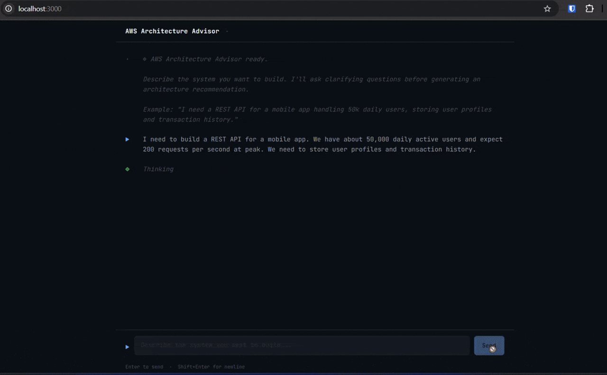
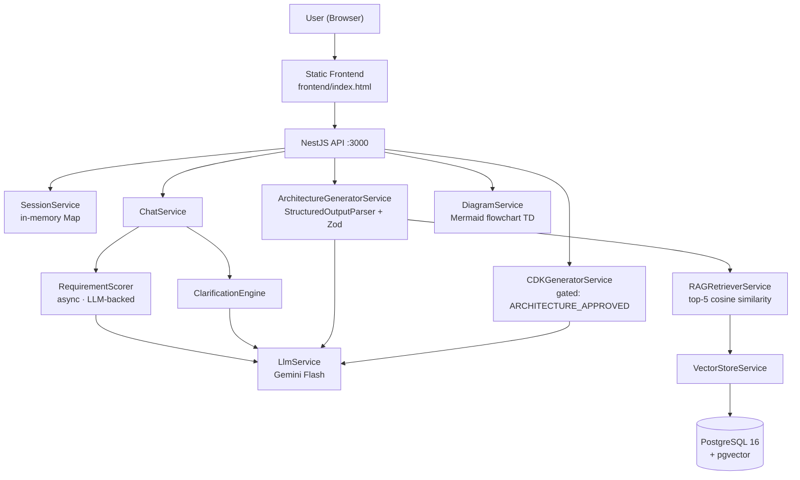

# AI Cloud Architecture Advisor

> AI-powered AWS architecture recommendation engine — conducts structured clarification, retrieves grounded AWS patterns via RAG, and generates CDK TypeScript infrastructure code.

[](https://github.com/BibinFrancisK/ai-cloud-architecture-advisor/actions/workflows/ci.yml)
[](https://www.typescriptlang.org/)
[](https://nestjs.com/)
[](LICENSE)



---

## What It Does

1. **Intake** — Accepts free-form infrastructure requirements in natural language
2. **Clarify** — Asks structured clarifying questions across 6 requirement dimensions (scale, latency, persistence, team, budget, compliance) until the completeness score reaches ≥ 70/100
3. **Recommend** — Retrieves grounded AWS patterns from an 8-file knowledge base via RAG, then generates a structured architecture with services, explicit tradeoffs, Well-Architected alignment scores, and a Mermaid diagram
4. **Generate** — Produces AWS CDK TypeScript infrastructure code, gated behind architecture approval — the system never generates CDK without a reviewed and approved architecture

This is not a toy chatbot. It demonstrates: multi-turn stateful AI conversations with structured clarification gates, RAG with vector similarity search, Zod-validated structured LLM output, and AWS CDK generation with guardrails.

---

## Key Technical Highlights

- **RAG pipeline** — LangChain.js + pgvector (PostgreSQL 16) + `gemini-embedding-001` embeddings; 8 curated AWS knowledge-base files chunked into ~150 vectors; top-5 cosine-similarity chunks injected into every architecture prompt
- **LLM-backed requirement scoring** — `RequirementScorer` makes a single structured Gemini call that returns dimension scores (SCALE, LATENCY, PERSISTENCE, TEAM, BUDGET, COMPLIANCE 0–2) from the full conversation text; eliminates regex maintenance and handles natural language paraphrasing correctly
- **Structured output enforcement** — `ArchitectureRecommendation` is a Zod schema; LangChain `StructuredOutputParser` validates every LLM response before it touches a caller; malformed JSON never reaches the API response
- **Mermaid diagrams from JSON** — `DiagramService` converts the parsed `ArchitectureRecommendation` to `flowchart TD` Mermaid syntax; diagrams render natively on GitHub and in the chat UI via CDN
- **Strict state machine, enforced by Guards** — `SessionExistsGuard` and `RequirementsCompleteGuard` are NestJS Guards wired to the route definitions; `POST /generate-cdk` returns `403` if `status !== ARCHITECTURE_APPROVED` with no application-layer workaround possible
- **Session state machine** — strict one-way flow: `CLARIFYING → READY_TO_GENERATE → ARCHITECTURE_GENERATED → ARCHITECTURE_APPROVED → CDK_GENERATED`
- **AWS CDK infrastructure** — the project dogfoods itself: `infra/lib/advisor-stack.ts` provisions VPC, ECS Fargate, RDS PostgreSQL, ECR, CloudWatch Logs, and Secrets Manager using CDK v2

---

## Architecture



See [ARCHITECTURE.md](ARCHITECTURE.md) for full diagrams including the conversation state machine, RAG pipeline, and AWS deployment layout.

---

## Tech Stack

| Layer | Technology |
|-------|-----------|
| Backend | NestJS 11, TypeScript 5 |
| AI Orchestration | LangChain.js 0.3 |
| LLM | Google Gemini Flash (`gemini-flash-latest`, free tier) |
| Embeddings | Google `gemini-embedding-001` (3072-dim) |
| Vector Store | PostgreSQL 16 + pgvector |
| Infrastructure as Code | AWS CDK v2 (TypeScript) |
| Containers | Docker Compose (DB only; API runs with hot reload outside Docker) |
| CI/CD | GitHub Actions (lint → type-check → unit tests → integration tests → Docker build → ECR push → CDK deploy) |
| Deployment | AWS ECS Fargate + RDS PostgreSQL t3.micro (free tier) |

---

## Quick Start

### Prerequisites

- Node.js 20+
- Docker + Docker Compose
- Google Gemini API key — free at [aistudio.google.com](https://aistudio.google.com)

### Run Locally

```bash
git clone https://github.com/BibinFrancisK/ai-cloud-architecture-advisor
cd ai-cloud-architecture-advisor

# Configure environment
cp .env.example .env
# Edit .env — set GEMINI_API_KEY and POSTGRES_* vars

# Start PostgreSQL + pgvector
docker compose up -d

# Install API dependencies and load the knowledge base (one-time)
cd apps/api
npm install
npm run ingest          # Chunks, embeds, and stores 8 AWS Markdown files into pgvector

# Start the API with hot reload
npm run start:dev
```

Open **http://localhost:3000** for the chat UI.  
Open **http://localhost:3000/api/docs** for the Swagger API explorer.

---

## API Overview

All endpoints are scoped to a session. Create a session first, then drive the conversation via `/chat`.

| Endpoint | Method | Description |
|----------|--------|-------------|
| `/sessions` | POST | Create a new conversation session |
| `/sessions/:id/chat` | POST | Send a message — receive clarification question, readiness notice, or architecture |
| `/sessions/:id/architecture` | GET | Retrieve the generated `ArchitectureRecommendation` |
| `/sessions/:id/architecture/approve` | POST | Approve (or request revision of) the architecture |
| `/sessions/:id/generate-cdk` | POST | Generate CDK TypeScript code — requires `ARCHITECTURE_APPROVED` |
| `/sessions/:id/diagram` | GET | Get Mermaid syntax + `mermaid.live` render URL |
| `/health` | GET | Service health: DB connectivity + LLM availability |
| `/admin/ingest` | POST | Trigger knowledge-base re-ingestion (202, runs in background ~80 s) |
| `/admin/ingest/status` | GET | Current chunk count in the vector store |

Full interactive documentation is available at `/api/docs` (Swagger UI).

---

## Project Structure

```
ai-cloud-architecture-advisor/
├── .github/workflows/ci.yml     # Lint → test → Docker build → ECR push → CDK deploy
├── apps/api/                    # NestJS backend
│   └── src/
│       ├── architecture/        # Architecture generation + Mermaid diagram
│       ├── cdk/                 # CDK TypeScript code generation
│       ├── chat/                # Entry point for user messages
│       ├── clarification/       # RequirementScorer + ClarificationEngine
│       ├── common/              # Guards, filters, interceptors, types, constants
│       ├── health/              # GET /health
│       ├── llm/                 # Gemini client + PromptBuilderService
│       ├── rag/                 # pgvector CRUD, embeddings, ingestion
│       └── session/             # In-memory session store
├── docs/                        # Architecture diagrams + demo GIF
├── frontend/                    # Static chat UI (HTML + JS, served by NestJS)
├── infra/                       # AWS CDK stack (VPC, ECS Fargate, RDS, ECR, Secrets Manager)
├── knowledge-base/              # 8 curated AWS Markdown files (RAG source)
├── scripts/                     # init.sql (pgvector schema)
├── docker-compose.yml           # PostgreSQL + pgvector (local dev)
├── Dockerfile                   # Multi-stage production image
├── ARCHITECTURE.md              # Deep-dive: diagrams, module map, design decisions
└── README.md
```

---

## Running Tests

```bash
cd apps/api

npm run test:unit          # Unit tests — no DB or LLM required (mocked)
npm run test:integration   # Integration tests — requires Docker DB running
npm run lint               # ESLint
npm run type-check         # tsc --noEmit
```

---

## Deployment

Infrastructure is defined in `infra/lib/advisor-stack.ts` (AWS CDK v2). The stack provisions:

- **ECR** — Docker image repository
- **VPC** — public + private + isolated subnet groups across 2 AZs
- **ECS Fargate** — API container (256 CPU / 512 MiB); secrets injected natively, CloudWatch Logs, rolling deploys
- **RDS PostgreSQL t3.micro** — pgvector-enabled database in isolated subnet (free tier)
- **Secrets Manager** — stores `GEMINI_API_KEY` and DB credentials; injected into container at runtime

CI/CD auto-deploys on every merge to `main` via GitHub Actions: quality checks → Docker build validation → CDK deploy → ECR push → ECS rolling redeployment. The deploy job is skipped when the `DEPLOY_ENV` repository variable is not set, making the workflow safe to run in forks without AWS credentials.

```bash
cd infra
npm install
cdk deploy --context env=dev   # Manual deploy
```

---

## Architecture Decisions

See [ARCHITECTURE.md](ARCHITECTURE.md) for the reasoning behind key design choices:

- Why in-memory sessions (not Redis or a database)
- Why LLM-backed scoring replaced the regex `RequirementScorer`
- Why Zod schema enforcement over trusting raw LLM output
- Why pgvector over a managed vector database (Pinecone, Weaviate)

---

## Future Enhancements

| Enhancement | Signal |
|-------------|--------|
| Streaming responses (SSE) | Real-time UX |
| Multi-cloud support (Azure, GCP patterns) | Cloud-agnostic thinking |
| Cost estimation via AWS Pricing API | Business value orientation |
| Architecture versioning (compare v1 vs v2) | Product depth |
| Terraform generation alongside CDK | Ecosystem awareness |
| OpenTelemetry tracing (Jaeger in Docker Compose) | Production observability |
| BM25 hybrid search (keyword + vector) | Advanced RAG techniques |
| Investigate 2 missing chunks from Day 4 ingestion (98/100 stored) | Reliability / observability |

---

## License

MIT — see [LICENSE](LICENSE).
